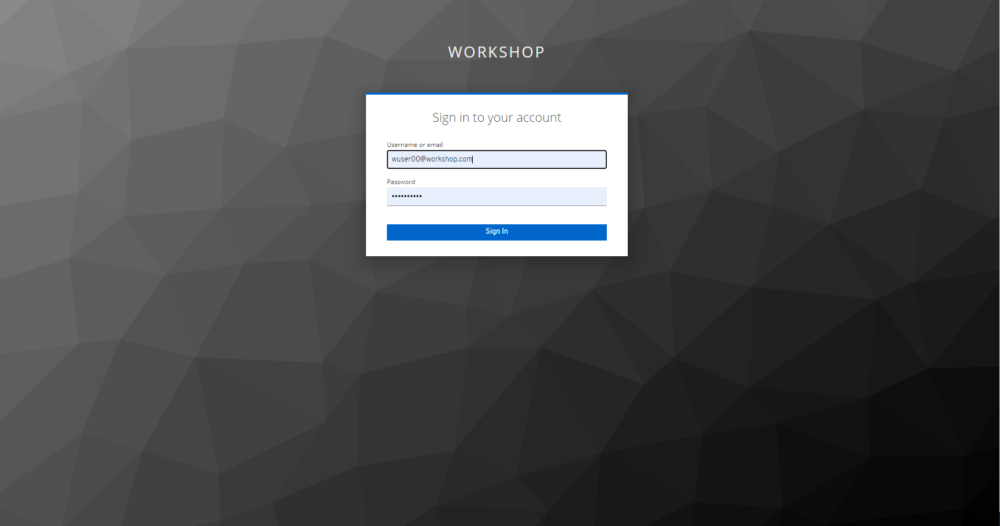

=== Step 1(b): Define CDP Workload Password

*`Suggestion:`* `Ideal way to work through this workshop will be to have 2 Incognitio mode browers opened. One to be used in a way that you can follow instructions using GitHub and the other one to be used for the workshop related screens.` +

Please use the login URL provided by instructor. +
Enter the `Workshop Login Username` and `Workshop Login Password` shared by your instructor. +

(*Note*: Note that your username would be something like `wuser00@workshop.com` and not just `wuser00`). +
 +

//Update the password with your own password.
// +

You should be able to get the following home page of CDP Public Cloud.
image:step1b/1-2.PNG[] +

You will need to define your `CDP Workload Password` that will be used to acess non-SSO interfaces. You may read more about it https://docs.cloudera.com/management-console/cloud/user-management/topics/mc-access-paths-to-cdp.html[here].
Please keep it with you. If you have forgotten it, you will be able to repeat this process and define another one.

. Click on your `user name (Ex: wuser00@workshop.com`) at the lower left corner.
. Click on the `Profile` option.

image:step1b/1.PNG[] +

. Click option `Set Workload Password`.
. Enter a suitable `Password` and `Confirm Password`.
. Click button `Set Workload Password`.

image:step1b/2.PNG[] +

image:step1b/3.PNG[] +

{blank} +

Check that you got the message - `Workload password is currently set` or alternatively, look for a message next to `Workload Password` which says `(Workload password is currently set)`

image:step1b/4.PNG[] +
